# Java Orientado a Objetos

## Notas Java Orientado a Objetos

Los **paradigmas de programación** son una teoría que nos suministra una base y modelo estandarizado para resolver problemas con nuestro código.

La **Programación Orientada a Objetos** (POO) nos ayuda a analizar y entender todos estos problemas para resolverlos de la forma más sostenible en el futuro. Java surgió con este paradigma y es uno de los lenguajes que define en gran manera el rumbo que sigue la POO.

Este paradigma se compone de 4 elementos (que analizaremos a fondo más adelante):

- Clases
- Propiedades
- Métodos
- Objetos

Además, se basa en los siguientes 4 pilares:

- Encapsulamiento
- Abstracción
- Herencia
- Polimorfismo

### ¿Qué es un Objeto?

Los **Objetos** son todas las cosas físicas o conceptuales que tienen propiedades y comportamientos. Por ejemplo: usuario, sesión, auto, etc.

Las **Propiedades** o atributos son las características de nuestros objetos. Estos atributos siempre serán sustantivos y pueden tener diferentes valores que harán referencia a nombres, tamaños, formas y estados.

Por ejemplo: el color del auto es verde o rojo (`color` es el atributo, `verde` y `rojo` son posibles valores para este atributo).

Los **Comportamientos** o métodos serán todas las operaciones de nuestros objetos que solemos llamar usando verbos o sustantivos y verbos. Por ejemplo: los métodos del objeto sesión pueden ser `login()`, `logout()`, `makeReport()`, etc.

### Abstracción: ¿Qué es una Clase?

La **Abstracción** se trata de analizar objetos de forma independiente, sus propiedades, características y comportamientos, para *abstraer* su composición y generar un modelo, lo que traducimos a código como clases.

Las **Clases** son los modelos sobre los cuales construimos nuestros objetos, es decir, las clases son los “moldes” que nos permiten generar objetos. Cada clase debe tener identidad (con un nombre de clase único usando Upper Camel Case), estado (con sus atributos) y comportamiento (con sus métodos y operaciones).

Por ejemplo:

```text
El ejemplo de clase más típico en Internet:

Nombre de la clase: Person
Atributos: Name, Age
Operaciones: Walk()
```

#### DIAGRAMA DE CLASES

Para entender qué es un diagrama de clases, lo primero que se debe tener claro es **qué es una clase**, pues bien, una clase es un elemento importante dentro del contexto de un sistema, que puede tener información o datos valiosos y realizar acciones que sean necesarias dentro del funcionamiento del sistema.

**Por ejemplo**, en un software para un supermercado, seguramente los elementos más importantes sobre los cuales sea significativo mantener información son los productos, los clientes, las ventas y los pedidos, en este caso se han encontrado las clases **PRODUCTO, CLIENTE, VENTA y
PEDIDO.**

Estas clases a su vez tienen **atributos** (datos) y **métodos** (funciones), por ejemplo, la clase **PRODUCTO** tiene como uno de sus atributos, el atributo *precio* y uno de sus métodos puede ser *incrementarPrecio*. De esta forma, a través de los atributos se puede acceder a la información de la clase y a través de los métodos se pueden ejecutar acciones sobre la clase. Estas clases se unen a otras clases a través de relaciones y así se conforma el diagrama de clases.

Toda clases se compone de **3 elementos importantes** así: **Nombre de la clase**, **Atributos** o propiedades también denominados miembros de la clase y los **métodos (operaciones)** o
acciones propias de la clase. *(Estas acciones se identifican con verbos en infinitivo)*.

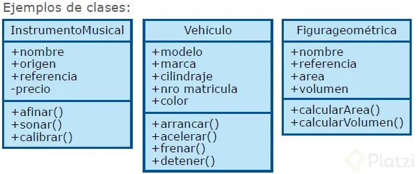

**Atributos**:

Los atributos o características de una Clase pueden ser de tres tipos, definen la visibilidad:

- **Public (+)** : Indica que el atributo será visible tanto dentro como fuera de la clase, es decir, es accesible desde todos lados.
- **Private (-)** : Indica que el atributo sólo será accesible desde dentro de la clase (sólo sus métodos lo pueden acceder).
- **Protected (#)** : Indica que el atributo no será accesible desde fuera de la clase, pero si podrá ser accedido por métodos de la clase además de las subclases que se deriven (herencia).
- **Sin modificador de acceso ( )** : Indica que el atributo será accesible desde cualquier clase que se encuentre en el mismo paquete de la clase que contiene al atributo sin modificador de acceso.

**Métodos**:

Los métodos u operaciones de una clase son la forma en cómo ésta interactúa con su entorno, éstos pueden tener las características:

- **Public (+)** : Indica que el método será visible tanto dentro como fuera de la clase, es decir, es accesible desde todos lados.
- **Private (-)** : Indica que el método sólo será accesible desde dentro de la clase (sólo otros métodos de la clase lo pueden acceder).
- **Protected (#)** : Indica que el método no será accesible desde fuera de la clase, pero si podrá ser accedido por métodos de la clase además de métodos de las subclases que se deriven (herencia).
- **Sin modificador de acceso ( )** : Indica que el método será
accesible desde cualquier clase que se encuentre en el mismo
paquete de la clase que contiene al método sin modificador de
acceso.

### Modularidad

La **Modularidad** consiste en dividir nuestro programa en diferentes módulos de forma que puedan unirse o separarse sin romperse entre ellos o perder alguna funcionalidad.

La Modularidad en Programación Orientada a Objetos nos ayuda a:

- Reutilizar código.
- Evitar colapsos.
- Que nuestro código sea mantenible.
- Mejorar la legibilidad.
- Resolución rápida de problemas.


### Creando nuestra primera Clase

Nuestro proyecto es construir un sistema que nos permita listar y agendar nuestras citas médicas, por lo que debemos crear algunas clases para cada integrante del sistema: doctores, pacientes, entre otras.

Así vamos a crear nuestra primer clase con sus métodos y atributos:

```Java
// Clases:
public class Doctor {
  // Atributos:
  int id;
  String name;
  String speciality;

  // Comportamientos (métodos):
  public void showName() {
    // Instrucciones...
  }
}
```

Declarar un Objeto:

```Java
// Tipo de Objeto ---- Nombre del Objeto
Doctor myDoctor;

// Otro objeto del mismo tipo Doctor:
Doctor anotherDoctor;

```

Instanciar un Objeto:

```java
// Nombre del Objeto ---- Clase base para crear algún tipo de objetos
myDoctor = new Doctor();

// Otro objeto
anotherDoctor = new Doctor();

```

Declarar e instanciar un objeto en la misma línea:

```java
// Declarar el objeto ---- Instanciar el objeto
Doctor myDoctor = new Doctor();
```

Utilizar el objeto:

```java
// Declarar el objeto ---- Instanciar el objeto
Doctor myDoctor = new Doctor();
myDoctor.name = "Diego";
myDoctor.showName();
```

### Método constructor

El **Método Constructor** es el primer método que se ejecuta por defecto cuando creamos una clase, nos permite crear nuevas instancias de una clase. Lo invocamos con la palabra reservada **new** seguida del nombre con el que inicializamos la clase y paréntesis.

El método constructor:

- **Crea** nuevas **instancias** de una clase.
- Tiene el **mismo nombre** que la clase que inicializa.
- Usa la palabra reservada **new** para invocarlo.

Usa **cero o más argumentos** contenidos dentro de los paréntesis que siguen al nombre.

```java
// nombreDeLaInstancia = new MétodoConstructor();
myDoctor = new Doctor();
```

El compilador de Java crea un método constructor en caso de que no definamos uno, pero de todas formas es muy buena idea programarlo nosotros, ya que nos permite definir y/o configurar el comportamiento de nuestros objetos usando argumentos.

```java
public class Doctor {
  // Atributos...

  // Método Constructor:
  Doctor(/* parámetros */) {
    // Instrucciones que se ejecutan al crear/instanciar
    // un nuevo objeto con la clase Doctor...
  }
}
```

El método constructor no debe regresar ningún valor (no necesitamos un **return**). Más adelante estudiaremos un poco más a fondo cómo funcionan la sobrecarga de métodos y sobrecarga de constructores.

Cuando es por **valor**, la información de la variable se **almacena** en una **dirección de memoria diferente al recibirla en la función**, por lo tanto si el valor de esa variable **cambia** !no!! afecta la variable original, solo se modifica dentro del contexto de la función.

Cuando es por **referencia**, la variable que se recibe como parámetro en la función apunta exactamente a la **misma dirección de memoria** que la variable original por lo que si dentro de la función se modifica su valor también se modifica la variable original.


### Static: Variables y Métodos Estáticos

Los métodos y variables estáticos nos ayudan a ejecutar o conseguir algún código desde clases que no han sido instanciadas, ya que sus valores se guardan en la memoria de nuestro programa, no en diferentes objetos instanciados a través de una clase.

Osea que no es necesario crear un objeto para poder usar este método o variable de tipo **static**.

Los métodos estáticos:

- Se pueden usar en toda la clase.
- Está definido por la palabra reservada **static**.
- Pueden ser **accesados indicando el nombre de la clase**, la notación punto y el nombre del método.
- Se invoca en una clase que **no tiene instancias de la clase**.

Las variables estáticas mantienen su valor durante todo el ciclo de vida de nuestro programa, por lo tanto, podemos alterar los valores de una variable estática desde una clase y consumir su valor alterado desde otra sin necesidad de conectar ambas clases.

También podemos importar los métodos estáticos de una clase para usarlos sin necesidad de escribir el nombre de la clase:

```java
public class Calculadora {
  public static int suma(int a, int b) {
    return a + b;
  }
}
```

```java
import static Calculadora;
import static java.lang.Math.*

public class Principal {
  public static void (String[] args) {
    int number = suma(3, 5);
    System.out.println(number + PI);
  }
}
```

### Creando elementos estáticos

En muchos casos nuestro código necesita ejecutar métodos que no necesariamente deben pertenecer a un objeto o instancia en concreto, ya que pueden ser muy generales (así como `Math.Random`) o los valores que almacenamos deben ser los mismos, sin importar si los consumimos desde una o más clases.

En todos estos casos vale la pena usar variables y métodos estáticos.

### Final: Variables Constantes

Para declarar una constante en java podemos utilizar la palabra reservada **final**. Casi siempre esta palabra
reservada va a estar de la mano con **static**, no es una regla, pero suele ser así.

En el código se vería así:

```java
public class Calculadora {
    public static final double PI = 3.1415926;
}
```

**Final** hace a esa variable constante, lo que significa que esa variable no podrá ser resignada nunca.

### Variable vs. Objeto: Un vistazo a la memoria

Otra diferencia entre las variables y los objetos es su situación en memoria, en donde viven las variables primitivas y en donde viven los objetos:

```java
int 1 = 0;
Doctor myDoctor = new Doctor();
Doctor myDoctor2 = new Doctor();
```

Normalmente cuando reasignamos el valor de 'i' a otra variable sabemos que automáticamente 'i' va a poseer el valor de esa nueva variable que ahora esta tomando, pero en el caso de los objetos es totalmente distinto, esto es por la ubicación que tiene cada elemento.

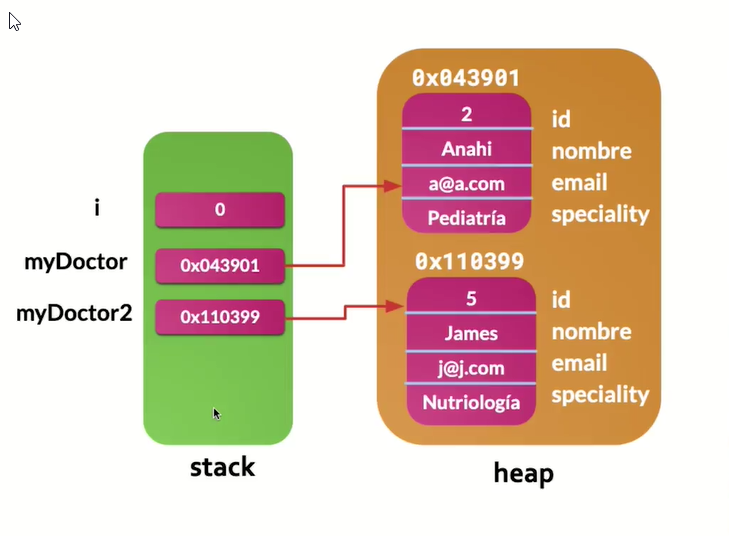

**Un objeto es una referencia a un espacio en memoria**. Cuando creamos objetos, Java los guarda en la memoria y nos devuelve coordenadas con las que podremos acceder a la información que almacenamos.

Existen dos tipos de memoria: **Stack** y **Heap**.

La memoria **Stack** es mucho más rápida y nos permite almacenar nuestra información de forma “ordenada”. Aquí se guardan las variables y sus valores de tipos de datos primitivos (booleanos, números, strings, entre otros).

Los objetos también usan la memoria Stack, pero no para guardar su información, sino para guardar las coordenadas a la verdadera ubicación del objeto en la memoria **Heap**, una memoria que nos permite guardar grandes cantidades de información, pero con un poco menos de velocidad.

### Sobrecarga de métodos y constructores

A veces necesitamos que dos o más métodos de una misma clase tengan el mismo nombre, pero con diferentes argumentos o distintos tipos de argumentos/valores de retorno.

Afortunadamente, Java nos permite ejecutar código y métodos diferentes dependiendo de los argumentos que reciba nuestra clase.

```java
public class Calculadora {
  // Los dos parámetros y el valor de retorno son de tipo int
  public int suma(int a, int b) {
    return a + b;
  }

  // Los dos parámetros y el valor de retorno son de tipo float
  public float suma(float a, float b) {
    return a + b;
  }

  // Un parámetro es de tipo int, mientras que el otro parámetro
  // y el valor de retorno son de tipo float
  public float suma(int a, float b) {
    return a + b;
  }
}
```

El uso más común de la sobrecarga de métodos es la sobrecarga de constructores para instanciar objetos de formas distintas dependiendo de la cantidad de argumentos que enviamos.

```java
public class Doctor {
  static int id = 0;
  String name;
  String speciality;

  public Doctor() {
    this.name = "Nombre por defecto";
    this.speciality = "Especialidad por defecto";
  }

  public Doctor(String name, String speciality) {
    this.name = name;
    this.speciality = speciality;
  }
} 
```

### Encapsulamiento: Modificadores de acceso

Los **Modificadores de Acceso** nos ayudan a limitar desde dónde podemos leer o modificar atributos especiales de nuestras clases. Podemos definir qué variables se pueden leer/editar por fuera de las clases donde fueron creadas. Esto lo conocemos como **Encapsulamiento**.

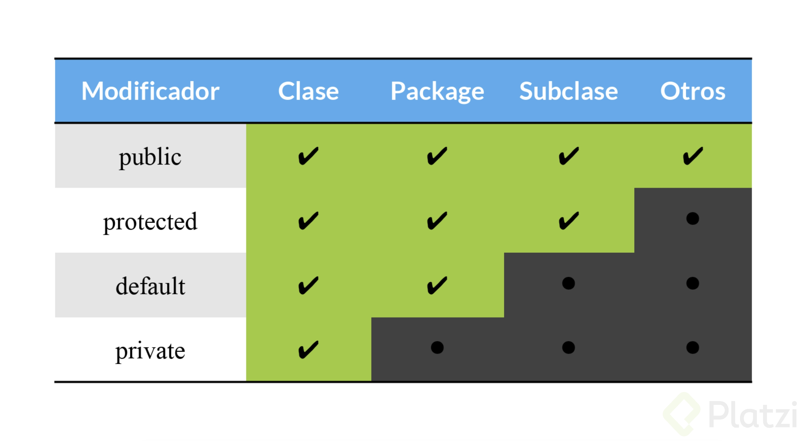


### Getters y Setters

Los **Getters** y **Setters** nos permiten leer y escribir (respectivamente) los valores de nuestras variables privadas desde fuera de la clase donde fueron creadas. Con los Getters obtenemos los datos de las variables y con los Setters asignamos o cambiamos su valor.

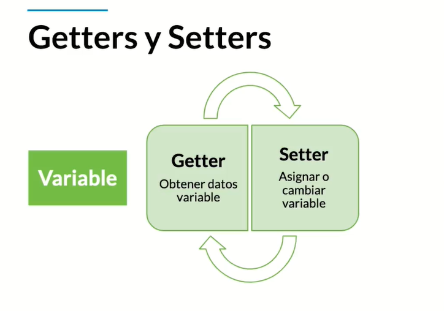

También puedes usar los atajos de tu IDE favorito para generar los métodos getters y setters de todas o algunas de tus variables.

```java
public class Patient {
  private String name;

  public String getName() {
    return "Patient name is " + this.name;
  }

  public void setName(String newName) {
    this.name = newName;
  }
}
```

### Variable vs. Objeto

Las **Variables** son entidades elementales muy sencillas, pueden ser números, caracteres, booleanos, entre otras. Los **Objetos** son entidades complejas que pueden estar formadas por la agrupación de diferentes variables y métodos.

Los **Objetos Primitivos** o **Clases Wrapper** son variables primitivas que trabajan con algún tipo de dato y también tienen las características de los objetos.

Por ejemplo: `Byte, Short, Integer, Long, Float, Double, Character, Boolean o String`.

### Clases Anidadas

Las **Clases Anidadas** o **Clases Helper** son clases dentro de otras clases que agrupamos por su lógica y/o características en común.

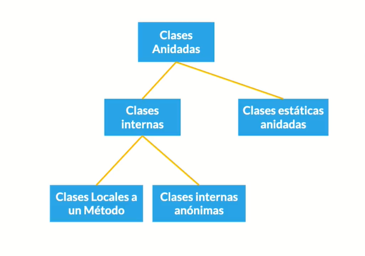

Podemos encontrar clases estáticas anidadas, clases internas que son locales a un método o clases internas anónimas. Las clases anidadas pueden llamar a cualquier tipo de elemento o método de nuestras clases.

Las **Clases Estáticas** no necesitan ser instanciadas para poder ser llamadas y ejecutadas, aunque debes recordar que solo permiten llamar a los métodos estáticos de sus clases padre.

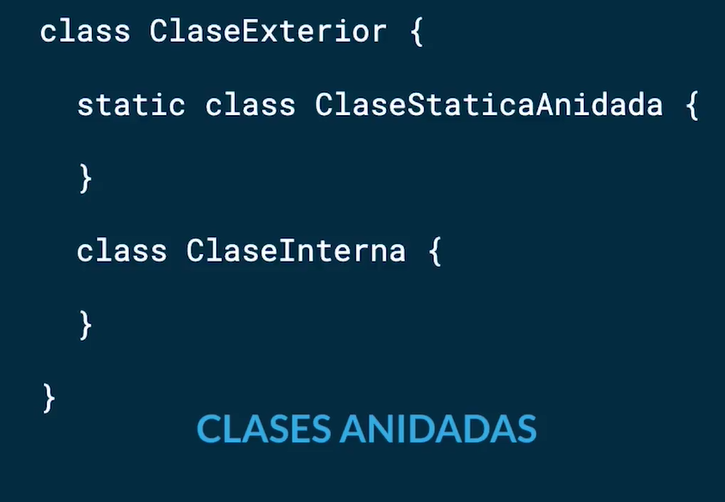

```java
public class Enclosing {
  private static int x = 1;

  public static class StaticNested {
    private void run() {
      //Implementation
    }
  }
}

public class Main {
  public static void main(String[] args) {
    Enclosing.StaticNested nested = new Enclosing.StaticNested();
    nested.run();
  }
}
```

### Clases Internas y Locales a un método

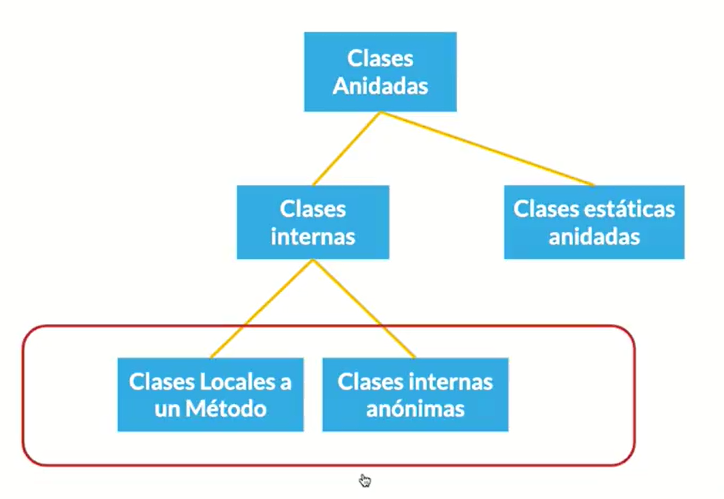

Se pueden encontrar como clases anidadas no estáticas

#### Clases Internas

```java
public class Outer {
  public class Inner {

  }
}

public class Main {
  public static void main(String[] args) {
    Outer outer = new Outer();
    Outer.Inner inner = outer.new Inner();
  }
}
```

Necesitamos crear dos objetos para tener acceso hasta la clase Inner, pero con las clases anidadas estáticas no es necesario esto.

Este tipo de clases (no estáticas) no son tan comunes.

#### Clases Locales a un Método

```java
public class Enclosing {
  void run() {
    class Local {
      void run() {

      }
    }

    Local local = new Local();
    local.run();
  }
}

public class Main {
  public static void main(String[] args) {
    Enclosing enclosing = new Enclosing();
    enclosing.run();
  }
}
```

La principal diferencia entre las clases locales a un método y las clases inner comunes es el scope que en este caso el scope de esta clase esta definido para el método run().

Esto puede ser un desperdicio de memoria ya que se están creando un objeto dentro de un método  y para llamar a ese método hay que crear otro objeto.

Es por eso que la mejor opción es utilizar las clases estáticas, porque estas clases van a ser mucho mas eficientes en términos de uso de memoria y cumplen la misma función.

**En resumen es mucho mejor y mas recomendable usar solamente las Clases Estáticas Anidadas.**

### Enumerations

Los enumerations son tipos de datos muy especiales pues este, es el único en su tipo que sirve para declarar una colección de constantes, al ser así estaremos obligados a escribirlos con mayúsculas.

Usaremos **enum** cada vez que necesitemos representar un conjunto fijo de constantes. *Por ejemplo los días de la semana*.

Así podemos declarar un enumeration usando la palabra reservada **enum**.

```java
public enum Day {
  SUNDAY, MONDAY, TUESDAY, WEDNESDAY,
  THURSDAY, FRIDAY, SATURDAY
}
```

Puedo crear referencias de enumerations de la siguiente forma:

```java
Day day;
switch (day) {
  case MONDAY:
    System.out.println(“Mondays are good.”);
    break;
  case FRIDAY:
    System.out.println(“Fridays are nice”);
    break;
  case SATURDAY: case: SUNDAY:
    System.out.println(“Weekends are the best”);
    break;
  default:
    System.out.println(“Midweek are so-so”);
    break;

}
```

Y puedo llamar un valor del enumeration así:

```java
Day.MONDAY;
Day.FRIDAY;
Day.SATURDAY;
```

Los enumerations pueden tener atributos, métodos y constructores, como se muestra:

```java
public enum Day {
  MONDAY("Lunes");
  TUESDAY("Jueves");
  FRIDAY("Viernes");
  SATURDAY("Sábado");
  SUNDAY("Domingo");

  private String spanish;
  private Day(String s) {
    spanish = s;
  }

  private String getSpanish() {
    return spanish;
  }
}
```

Y para utilizarlo lo podemos hacer así:

```java
System.out.println(Day.MONDAY);
```

Imprimirá: **MONDAY**

```Java
System.out.println(Day.MONDAY.getSpanish());
```

Imprimirá: **Lunes**.

### ¿Qué es la Herencia? Don't repeat Yourself

**Don’t repeat yourself** (DRY) consiste en detectar cuando estamos repitiendo el mismo código una y otra vez para crear algún método o función que nos ayude a evitar estos repetidos.

- Promueve la reducción de duplicación en programación.
- Las piezas de información **nunca deben duplicarse**.
- **Incrementa la dificultad** en los cambios y evolución, si no es implementada.

Esta es una de las bases de la programación que siempre debemos tener en cuenta, ya que nos ayuda a reducir la dificultad de nuestro código para implementar cambios y/o mejoras en nuestra aplicación.

La **Herencia** consiste en crear nuevas clases a partir de otras clases, establecemos una relación padre e hijo entre nuestras clases. Es diferente a las clases anidadas, ya que, en vez de crear clases dentro de clases, le indicamos a nuestras subclases de qué superclase pueden heredar **(extends)** para reutilizar el código de algunos de sus métodos.


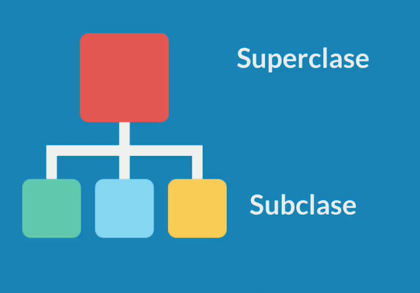

Recuerda que nuestras clases no pueden heredar de más de una clase.

```java
public class SuperClass {
  // ...
}

public class SubClass extends SuperClass {
  // ...
}
```

### Super y This

**Super** indica que una variable o método es de la clase padre, la *superclase* de cual heredan nuestras *subclases*, solo la usamos cuando aplicamos herencia.

Además, podemos llamar al constructor de la clase padre desde sus diferentes subclases usando `super()`; y enviando los argumentos que sean necesarios.

Por otro lado, **this** nos permite especificar que nuestras variables están señalando a la misma clase donde estamos trabajando, ya sea una clase normal, anidada, *subclase* o *superclase*.

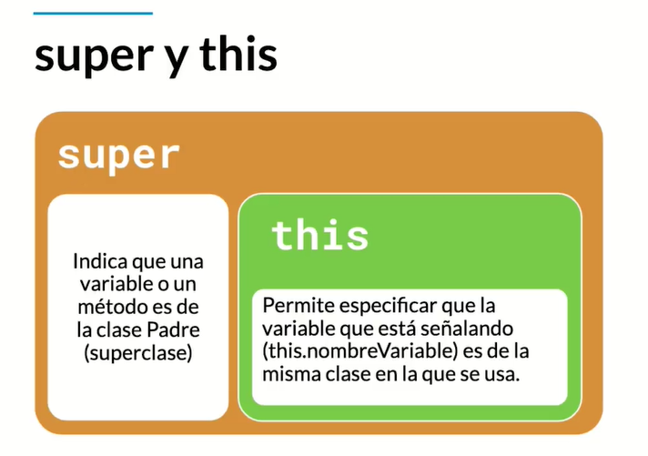

```java
public class User {
  int age = 1;

  public int getAge() {
    return this.age;
  }
}

public class Doctor extends User {
  String speciality = "Dentist";

  Doctor() {
    super.getAge(); // 1
    this.getSpeciality(); // Dentist
  }

  public int getSpeciality() {
    return this.speciality;
  }
}
```

### Polimorfismo: Sobreescritura de Métodos

El **Polimorfismo** es una característica de la programación orientada a objetos que consiste en sobrescribir algunos métodos de la clase de la cual heredan nuestras subclases para asignar comportamientos diferentes.

Además de los métodos de las superclases, también podemos redefinir el comportamiento de los métodos que “heredan” todos nuestros objetos, así como `.toString`, `hashCode`, `finalize`, `notify`, entre otros.

#### Sobreescritura

Cuando una clase hereda de otra y en esta clase hija se redefine un método con una implementación distinta a la de la clase padre.

La sobreescritura de constructores consiste en usar los miembros heredados de una *superclase* pero con argumentos diferentes.

Recuerda que no podemos sobrescribir los métodos marcados como **final** o **static**.

#### Polimorfismo

Cabe aclarar que en POO tenemos 3 clases de polimorfismo de las cuales ya hemos revisado 2 tipos:

- **Sobrecarga**: Podemos escribir un método con el mismo nombre varias veces cambiando los parámetros que recibe ya sea en cantidad o en tipos, ademas podemos retornar otro tipo de dato.

```java
public int suma (int num1, int num2) {
  return num1 + num2;
}
public String suma (String text1, String text2) {
  return num1 + " " + num2;
}
```

- **Sobreescritura**: Podemos escribir un método de la clase padre y cambiar su contenido y asi realizar comportamiento mas especifico:

```java
// Clase Padre User
public String toString () {
  return name + " " + email;
}

// Clase Hija Patient
public String toString () {
  return super.toString() + " " + blood + " " + weight;
}
```

- **Ligadura Dinámica**: Podemos ejemplificar a las clases hijas pero tratarlas como su clase padre, puede ser util por ejemplo si queremos un arreglo que contenga objetos tipo User pero que implícitamente también va a contener doctores y pacientes:

```java
User doctor = new Doctor ("Cristian", "criss.ud@gmail.com");
User paciente = new Patient ("Carlos", "carlos96@hotmail.com");
```

### Interfaces

Las **Interfaces** son un tipo de referencia similar a una clase con solo constantes y definiciones de métodos, son de gran ayuda para definir los comportamientos que son redundantes y queremos reutilizar un más de una clase, incluso cuando tenemos muchas clases y no todas pertenecen a la misma “familia”.

Las interfaces establecen la forma de las clases que la implementan, así como sus nombres de métodos, listas de argumentos y listas de retorno, pero NO sus bloques de código, eso es responsabilidad de cada clase.

De momento este es nuestro diagrama de clases:

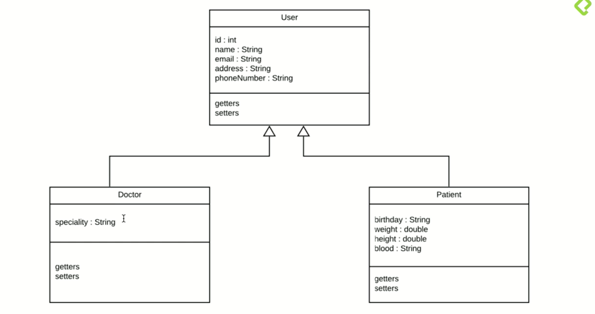

Ejemplo de interfaz:

```java
public interface ISchedulable {
  schedule(Date date, String Time);
}

public class AppointmentDoctor implements IShedulable {

}
```

Es muy común que la interfaces terminen en "able" porque se enfocan a las actividades que sean redundantes en el programa, como "Schedulable", "Readable", "Runnable", "Printable" o en otros casos cuando por alguna razón la interfaz no tiene esta naturaleza también es común encontrarlas con un "I" como en "ISchedulable".

#### Composición de Interfaces en Clases

Abstraer todos los métodos/comportamientos de una clase para modularizarlos (comprimirlos, encapsularlos) en una interfaz y reutilizar su código en diferentes clases.

Las interfaces se crean utilizando la palabra reservada `interface` y se implementan en nuestras clases con `implements`.

Recuerda que podemos heredar (implementar) más de una interfaz, pero no podemos hacerlo de las clases padres o *superclases*.

```java
public interface ISchedulabe {
  void schedule(Date date, String Time);
}

public class AppointmentDoctor implements ISchedulable {
  @Override
  public void schedule(Date date, String Time) {
    // ...
  }
}
```

- Las clases que tienen getters y setters también son conocidas como POJOS (Plain Old Java Objects).

**A diferencia de la herencia, las clases pueden implementar mas de una interface a la vez**.

### Collections

Otras interfaces que son muy importantes en Java son los llamados **Collections**.

Los Collections nos van a servir para trabajar con colecciones de datos, específicamente y **solamente con objetos**, para esto recuerda que tenemos disponibles nuestras clases Wrapper que nos ayudan a convertir datos primitivos a objetos.

Los collections se diferencian de los arrays en que su tamaño no es fijo y por el contrario es dinámico.

Diagrama de su composición:

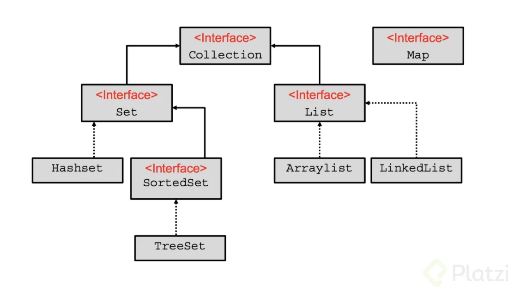

Como podemos observar el elemento más alto es la interfaz **Collection**, para lo cual, partiendo de su naturalidad de interface, entendemos que tiene una serie de métodos “básicos” dónde su comportamiento será definido a medida que se vaya implementando en más elementos. De ella se desprenden principalmente las interfaces **Set** y **List**.

La interface **Set** tendrá las siguientes características:

- Almacena objetos únicos, no repetidos.
- La mayoría de las veces los objetos se almacenarán en desorden.
- No tenemos índice.

La interface **List** tiene éstas características:

- Puede almacenar objetos repetidos.
- Los objetos se almacenan en orden secuencial.
- Tenemos acceso al índice.

#### **Si seguimos analizando las familias tenemos que de Set se desprenden:**

- Clase HashSet
- Interfaz SortedSet y de ella la clase TreeSet.

**HashSet** los elementos se guardan en **desorden** y gracias al mecanismo llamado hashing (obtiene un identificador del objeto) **permite almacenar objetos únicos**.

**TreeSet** almacena **objetos únicos**, y gracias a su estructura de árbol el **acceso es sumamente rápido**.

#### **Ahora si analizamos la familia List, de ella se desprenden:**

- Clase **ArrayList** puede tener duplicados, no está sincronizada por lo tanto es más rápida.
- Clase **Vector** es sincronizada, los datos están más seguros pero es más lento.
- Clase **LinkedList**, puede contener elementos duplicados, no está sincronizada (es más rápida) al ser una estructura de datos doblemente ligada podemos añadir datos por encima de la pila o por debajo.

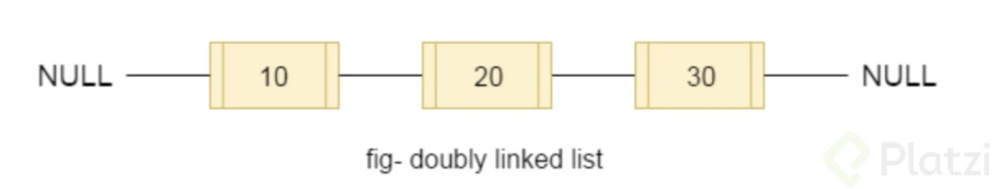

#### Sigamos con Map

Lo primero que debes saber es que tiene tres implementaciones:

- HashTable
- LinkedHashMap
- HashMap
- SortedMap ➡️ TreeMap

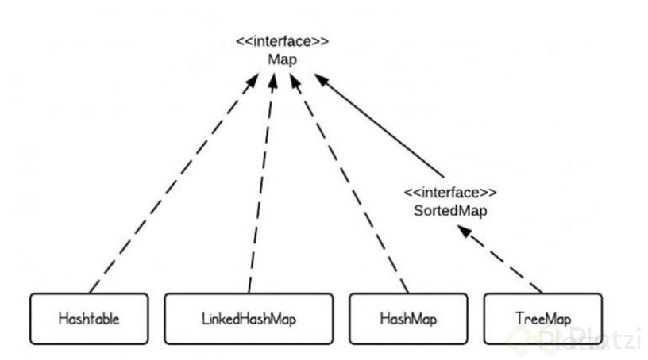

La interfaz **Map** no hereda de la interfaz Collection porque representa una estructura de datos de Mapeo y no de colección simple de objetos. Esta estructura es más compleja, pues cada elemento deberá venir en pareja con otro dato que funcionará como la llave del elemento.

#### Map

- **Donde K es el key o clave**.
- **Donde V es el value o valor**.

Podemos declarar un map de la siguiente forma:

```java
Map<Integer, String> map = new HashMap<Integer, String>();
Map<Integer, String> treeMap = new TreeMap<Integer, String>();
Map<Integer, String> linkedHashMap = new LinkedHashMap<Integer, String>();
```

Como observas solo se puede construir el objeto con tres elementos que implementan de ella: **HashMap**, **TreeMap** y **LinkedHashMap** dejando fuera HashTable y SortedMap. SortedMap estará fuera pues es una interfaz y HashTable ha quedado deprecada pues tiene métodos redundantes en otras clases.

Como te conté hace un momento Map tiene implementaciones:

- **HashMap**: Los elementos no se ordenan. No aceptan claves duplicadas ni valores nulos.
- **LinkedHashMap**: Ordena los elementos conforme se van insertando; provocando que las búsquedas sean más lentas que las demás clases.
- **TreeMap**: El Mapa lo ordena de forma “natural”. Por ejemplo, si la clave son valores enteros (como luego veremos), los ordena de menos a mayor.

Para iterar alguno de estos será necesario utilizar la interface **Iterator** y para recorrerlo lo haremos un bucle while así como se muestra:

#### Para HashMap

```java
// Imprimimos el Map con un Iterador
Iterator it = map.keySet().iterator();
while(it.hasNext()){
  Integer key = it.next();
  System.out.println("Clave: " + key + " -> Valor: " + map.get(key));
}
```

#### Para LinkedHashMap

```java
// Imprimimos el Map con un Iterador
Iterator it = linkedHashMap.keySet().iterator();
while(it.hasNext()){
  Integer key = it.next();
  System.out.println("Clave: " + key + " -> Valor: " + linkedHashMap.get(key));
}
```

#### Para TreeMap

```java
// Imprimimos el Map con un Iterador
Iterator it = treeMap.keySet().iterator();
while(it.hasNext()){
  Integer key = it.next();
  System.out.println("Clave: " + key + " -> Valor: " + treeMap.get(key));
}
```

### Clases Abstractas

A veces NO necesitamos implementar todos los métodos de una clase heredada o interfaz. No siempre necesitamos crear instancias o implementar todos los métodos heredados de una clase padre, así como tampoco podremos necesitar algún método de nuestras interfaces, pero estas nos obligan a escribir el código de todos los métodos que definimos genéricamente.

Afortunadamente, las **Clases Abstractas** resuelven todos estos problemas. Son una combinación entre interfaces y herencia donde no implementaremos todos los métodos ni tampoco crearemos instancias.

```java
public abstract class Figura {
  // ...
}

class Triangulo extends Figura {
  // ...
}
```

- Interface: te obliga a implementar todos los métodos.
- **Herencia**: A veces no necesitamos crear instancias de una clase padre, porque es muy genérica.
- **Clases Abstractas**: Combinación entre Interface y Herencia , no implementa todos los métodos, por su composición no es necesario instanciarlo, no se pueden crear instancias de una clase abstracta.

#### Miembros abstractos

Los **Métodos Abstractos** son los métodos que debemos implementar obligatoriamente cada vez que usemos nuestras clases abstractas, mientras que los métodos que no sean abstractos van a ser opcionales.

```java
public abstract class Figura {
  abstract void dibujar(); // obligatorio
  void dibujar3D(); // no es obligatorio
}

class Triangulo extends Figura {
  void dibujar() {
    // Instrucciones para dibujar el triángulo...
  }
}
```

Recuerda los métodos abstractos solo se pueden implementar en clases abstractas. Y las clases abstractas no necesitan ser instanciadas para ser implementadas.

La diferencia entre una clase abstracta y una interface, es que al crear un método abstracto en la clase abstracta (super_clase), se obliga a heredar este método a las clases hijas (sub_clases), en cambio al implementar una interface en una clase ya sea abstracta o concreta, debemos implementar TODOS los métodos que tenga dicha interface.

### Clases Anónimas

Las Clases Anónimas son una forma de instanciar clases abstractas sin necesidad de usar sus clases hijas. Pero este tipo de instanciación tiene algunas restricciones: el ciclo de vida de estas instancias NO es duradero, no las tendremos disponibles durante toda la ejecución del programa.

```java
// Clase Abstracta:
public abstract class Figura {
  abstract void dibujar();
}

// Clase Anónima:
User user = new User() {
  @Override
  public void showDataUser() {
    // Instrucciones...
  }
}; 
```

### Diferencias entre las Interfaces y las Clases Abstractas

#### **Clase Abstracta**

Una **clase abstracta** unicamente se utilizara para definir subclases, es decir, esta siempre deberá ser heredada para poder usar y sobrescribir los métodos, una restricción que tiene esta clase es que naturalmente no se podrán crear instancias u objetos de esta, unicamente solo se podrá heredar por lo tanto la herencia de métodos se hará de forma lineal, es decir, desde una clase padre hasta una clase hijo y asi sucesivamente, podemos heredar métodos abstractos y no abstractos por lo tanto una clase abstracta solo me servirá para redefinir nuevas clases sin necesidad de crear nuevos objetos.

#### **Interface**

Las **interfaces** tienen una estructura similar de métodos abstractos y no abstractos, pero aquí el enfoque sera en los métodos, estos pueden implementarse en muchas familias de clases, la implementación de métodos deja de ser lineal como en las clases abstractas. Usaremos las Interfaces para implementar métodos que se comparten entre familias, es decir, la relación va mas allá de la herencia entre dos clases.

Otra diferencia es el como nombramos a la clase abstracta y a una interfaz, en la clase abstracta pensaremos mas en objetos y en las interfaces pensaremos mas en las acciones que pueden tener en común muchos objetos, es común encontrar nombres como: Drawable, Runnable, Callable, Visualizable. Para las clases abstractas tendremos nombres como: Film, Publication, Figure(esta podrá ser heredada en otros tipos de figura como cuadrados, triángulos, círculos, etc).

La palabra clave en ambos elementos es **abstracto**. Una buena practica es que el diseño de tus aplicaciones siempre este orientado a interfaces y no a la implementación, concentrate en crear buenas abstracciones, intenta encontrar el comportamiento común, enfocate en la declaración de tus métodos. Si tratas de manera homogénea y con independencia tus módulos, tus programas serán mucho mas escalables y eficientes.

### Interfaces en Java 8 y 9

Las **Interfaces** nos permiten usar métodos abstractos y campos constantes para implementar herencia/polimorfismo de forma muy similar a las clases abstractas.

A partir de Java 8 podemos tener implementación en métodos para heredar y reutilizar diferentes comportamientos. No todos los métodos de nuestras interfaces deben ser abstractos, ahora podemos usar el modificador de acceso `default` y desde Java 9 también `private`.

Recuerda que el nivel de acceso de default y private son los mismos que estudiamos en clases anteriores.

```java
public interface MyInterface {
  // Métodos default: nos permite heredar la definición
  // de la función y también su implementación...
  default void defaultMethod() {
    privateMethod("Hello from the default method!");
  }

  // Métodos private: nos permiten definir comportamiento,
  // pero solo se puede usar desde otras clases de esta
  // interfaz, no se hereda a la clase hija....
  private void privateMethod(final String message) {
    System.out.println(message);
  }

  // Métodos abstractos: recuerda que todos los métodos
  // son abstractos por defecto...
  void normalMethod();
}
```


### Herencia en interfaces

Las interfaces pueden heredar de otras interfaces utilizando la palabra clave extends, el concepto de herencia se aplicará como naturalmente se practica en clases, es decir, la interfaz heredará y adquirirá los métodos de la interfaz padre.

Una cosa interesante que sucede en caso de herencia con interfaces es que, aquí sí es permitido la herencia múltiple como ves a continuación:

```java
public interface IReadable {
  public void read();
}


public interface Visualizable extends IReadable, Serializable {
  public void setViewed();
  public Boolean isViewed();
  public String timeViewed();
}
```

Además siguiendo las implementaciones de métodos default y private de las versiones Java 8 y 9 respectivamente podemos sobreescribir métodos y añadirles comportamiento, si es el caso.

```java
public interface Visualizable extends IReadable, Serializable {
  public void setViewed();
  public Boolean isViewed();
  public String timeViewed();

@Override
  default void read() {
  // TODO Auto-generated method stub
  }
}
```

### Definiendo las citas disponibles

Algunas veces necesitamos trabajar las fechas como tipo de dato Date y otras veces como String. Para resolver esto podemos usar `SimpleDateFormat`.

```java
SimpleDateFormat format = new SimpleDateFormat(pattern: "dd/MM/yyyy");

// Transformar fechas de formato String a Date:
this.date = format.parse(dateAsString);

// Transformar fechas de formato Date a String:
this.date = format.format(dateAsDate);
```

### Recorriendo estructuras de árbol en Java

Las **estructuras de árbol** pertenecen al grupo de estructuras de datos no lineales, es decir, donde toda la información es almacenada con un orden específico. En estas estructuras tenemos “troncos” principales con diferentes ramificaciones que surgen a partir de ellos. Son muy útiles para trabajar con grandes cantidades de datos organizados de forma jerárquica.

La forma de implementarlos en Java es usando un Map de tipo TreeMap. Recuerda que también podemos guardar Maps dentro de otros Maps. De esta forma podemos definir una lista ordenada de doctores y sus fechas disponibles para agendar citas médicas.

```java
// 1. Doctor#1
// - - - Fecha#1
// - - - Fecha#2
// 2. Doctor#2
// - - - Fecha#1
// - - - Fecha#2
// 3. Doctor#3
// - - - Fecha#1
// - - - Fecha#2
Map<Integer, Map<Integer, Doctor>> doctors = new TreeMap<>();
```