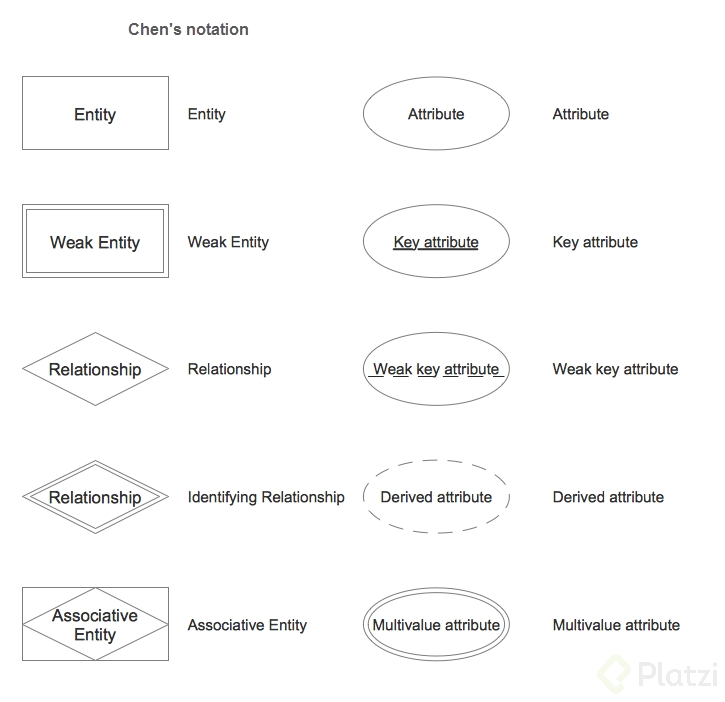
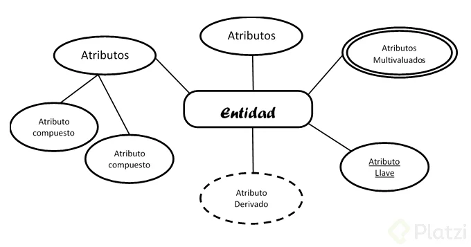
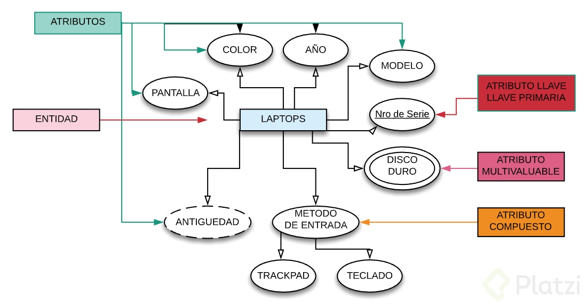
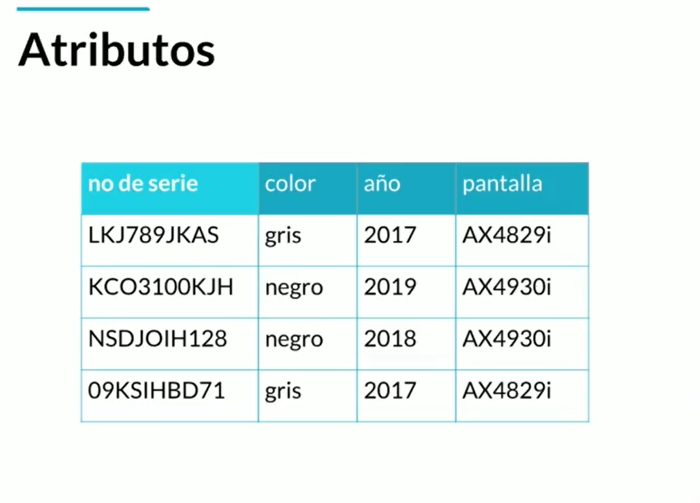
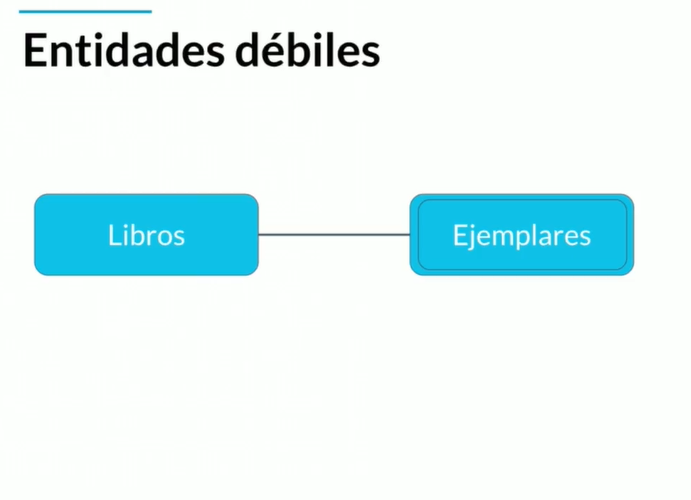
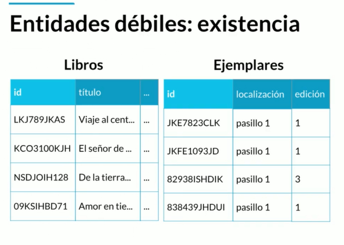
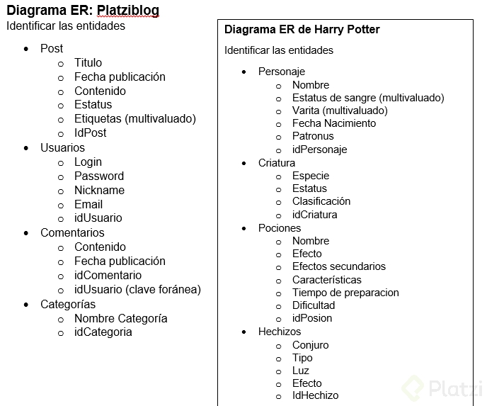

# Fundamentos de Bases de Datos

## Notas

### Conceptos Básicos y contexto histórico de las Bases de Datos

El almacenamiento en la nube tiene un gran pro comparado con los otros métodos de almacenamiento ya que es accesible desde cualquier parte del mundo. Además es centralizada y puede ser usada por varias personas al mismo tiempo.

Las bases de datos entran cuando hacemos la transición a medios digitales.

#### **Tipos de bases de datos**

- **Relacionales**: En la industria hay varias compañías dedicadas a ser manejadoras de bases de datos relacionales como **SQL Server**, **Oracle**, **MariaDB**, entre otras.
- **No relacionales**: Todavía están avanzando y existen ejemplos muy distintos como **cassandra**, **elasticsearch**, **neo4j**, **MongoDB**, entre otras.

#### **Servicios**

- **Auto administrados**: Es la base de datos que instalas tú y te encargas de actualizaciones, mantenimiento, etc.
- **Administrados**: Servicios que ofrecen las nubes modernas como Azure y no debes preocuparte por mantenimiento o actualizaciones.

### Historia de las RDB (Relational Data Base)

Las bases de datos surgen de la necesidad de conservar la información más allá de lo que existe en la memoria RAM.

Las bases de datos **basadas en archivos** eran datos guardados en texto plano, fáciles de guardar pero muy difíciles de consultar y por la necesidad de mejorar esto nacen las **bases de datos relacionales**. Su inventor **Edgar Codd** dejó ciertas reglas para asegurarse de que toda la filosofía de las bases de datos no se perdiera, estandarizando el proceso.

#### LAS 23 REGLAS DE CODD DEL MODELO RELACIONAL

- **Regla 1: REGLA DE LA INFORMACIÓN**
  - Toda la información en una base de datos relacionales se muestra explícitamente en el nivel lógico mediante tablas y solo mediante tablas.
  - Por tanto, los metadatos (diccionario, catalogo) se representan y manipulan exactamente igual que los datos de usuario, usando quizás el mismo lenguaje (ejemplo SQL).
- **Regla 2: REGLA DEL ACCESO GARANTIZADO**
  - Para todos y cada uno de los datos (valores atómicos) de una base de datos relacional se garantiza que son accesibles a nivel lógico utilizando una combinación de nombre de tabla, valor de clave primaria y nombre de columna.
  - Cualquier dato almacenado en una base de datos relacionales tiene que poder ser direccionado unívocamente. Para ello hay que indicar en qué tabla está, cuál es la columna y cuál es la fila primaria.
- **Regla 3: TRATAMIENTO SISTEMÁTICO DE VALORES NULOS**
  - Se debe disponer de valores nulos (distinto de la cadena vaciá, blancos, 0, etc) para representar información desconocida o no aplicable de manera sistemática, independiente del tipo de datos.
  - Se reconoce la necesidad de la existencia del valor nulo, el cual puede servir para representar, o bien, una información desconocida (ejemplo, no se sabe la dirección de un empleado).
- **Regla 4: CATÁLOGO DINÁMICO EN LÍNEA BASADO EN EL MODELO RELACIONAL**
  - La descripción de la base de datos se representa a nivel lógico de la misma manera que los datos normales, de modo que los usuarios autorizados pueden aplicar el mismo lenguaje relacional a su consulta, igual que lo aplican los datos normales.
  - Los metadatos se almacenan y se manejan usando el modelo relacional, con todas las consecuencias.
- **Regla 5: REGLA DEL SUB-LENGUAJE DE DATOS COMPLETO**
  - Un sistema relacional debe soportar varios lenguajes y varios modos de uso de terminal (ejemplo: rellenar formularios, etc). Sin embargo, debe existir al menos un lenguaje cuyas sentencias sean expresables, mediante una sintaxis bien definida, como cadenas de caracteres y que sea completo.
  - Además, debe tener una interfaz de usuario para hacer consultas, etc. Siempre debe haber una manera de hacerlo todo de manera textual, que es tanto como decir que puede ser incorporado en un programa tradicional. Un lenguaje que cumple esto en gran medida es SQL.
- **Regla 6: REGLA DE ACTUALIZACIÓN DE VISTAS**
  - Todas las vistas que son teóricamente actualizables se pueden actualizar también por el sistema.
  - El problema está determinado en las vistas teóricamente actualizables, ya que no está muy claro.
  - Cada sistema puede hacer las suposiciones particulares sobre las vistas que son actualizables.
- **Regla 7: INSERT, UPDATE, DELETE DE ALTO NIVEL**
  - La capacidad de manejar una relación base o derivada como un solo operando se aplica no sólo a la recuperación de los datos (consultas), sino también a la inserción, actualización y borrado de datos.
  - Esto es, el lenguaje de manejo de datos también debe ser de alto nivel. Algunos sistemas de la cuenta se modifican en las filas de una tabla a la vez.
- **Regla 8: INDEPENDENCIA DE LA REPRESENTACIÓN FÍSICA DE DATOS**
  - Los programas de aplicación y actividades de terminal permanecen inalterados a nivel lógico cualesquiera sean  los cambios efectuados, tanto en la representación del almacenamiento, como en los métodos de acceso.
  - El modelo relacional es un modelo lógico de datos, y oculta las características de su representación física.
- **Regla 9: INDEPENDENCIA DE MODIFICACIONES LÓGICAS DE DATOS**
  - Los programas de aplicación y actividades del terminal permanecen inalterados a nivel lógico cualesquiera sean los cambios que se realicen a las tablas base que preserven la información.
  - Cuando se modifica el esquema lógico preservando información, no se necesita modificar nada en niveles superiores.
- **Regla 10: INDEPENDENCIA DE LAS RESTRICCIONES DE INTEGRIDAD**
  - Las restricciones de integridad para una determinada base de datos relacionales pueden ser definidos en el lenguaje de datos relacionales, y almacenables en el catálogo, no en el programa de aplicación.
  - Como parte de las restricciones inherentes al modelo relacional (parte de su definición):
    - Integridad de Entidad: Toda tabla debe tener una clave primaria.
    - Integridad de Dominio: Toda columna de una tabla contendrá valores exclusivamente de un determinado dominio (conjunto de valores válidos)
    - Integridad Referencial: Toda clave foránea no nula debe existir en la relación donde es clave primaria.
- **Regla 11: INDEPENDENCIA DISTRIBUIDA**
  - Una Base de Datos Relacional es independiente de la distribución.
  - Las mismas tareas y programas se ejecutan igual en una base de datos centralizada que en una distribuida.
  - Las bases de datos son fácilmente distribuibles.
- **Regla 12: REGLA DE LA NO SUBVERSIÓN**
  - Si un sistema relacional tiene un lenguaje de bajo nivel, el nivel bajo no puede ser usado para subvertir (saltarse) las reglas de integridad y las restricciones expresadas en los lenguajes relacionales de más alto nivel a la vez.
  - Algunos problemas no se pueden solucionar directamente con el lenguaje de alto nivel.
  - Normalmente se usa SQL incorporado en un lenguaje anfitrión para solucionar estos problemas. Se utiliza el concepto de cursor para tratar individualmente las filas de una tabla. En cualquier caso no debe ser posible saltarse las restricciones de integridad impuestos al tratar las filas a ese nivel.

### Entidades y atributos

Una **entidad** es algo similar a un objeto (programación orientada a objetos) y representa algo en el mundo real, incluso algo abstracto. Tienen atributos que son las cosas que los hacen ser una entidad y por convención se ponen en plural.

Los **atributos compuestos** son aquellos que tienen atributos ellos mismos.

Los **atributos llave** son aquellos que identifican a la entidad y no pueden ser repetidos. Existen:

- **Naturales**: son inherentes al objeto como el número de serie.
- **Clave artificial**: no es inherente al objeto y se asigna de manera arbitraria.

**Entidades fuertes**: son entidades que pueden sobrevivir por sí solas.

**Entidades débiles**: no pueden existir sin una entidad fuerte y se representan con un cuadrado con doble línea.

- **Identidades débiles por identidad**: no se diferencian entre sí más que por la clave de su identidad fuerte.
- **Identidades débiles por existencia**: se les asigna una clave propia.

La nomenclatura usada para representar las entidades se llama Notación de Chen.

Algunos símbolos que se usan para la representación de entidades:

Las entidades se escriben en plural y estan representadas por un conjunto de atributos.

Estas pueden ser:

- Concreta: Persona, empleado, casa, auto, etc.
- Abstracta: Cuenta Bancaria, empresa, curso.

- Multivaluados: Puede tener varios valores (teléfonos, hijos, discos duros).
- Compuestos: Desde los cuales se desprenden más atributos.
- Llave: Aquel que identifica la entidad y no se puede repetir y existen dos tipos:
  - Natural: Son inherentes del Objeto (Cedula, n° serie).
  - Artificial: No es inherente al Objeto y se asigna arbitrariamente.
- Derivados: Es aquel que se obtiene de un atributo definido (fecha de nacimiento = edad).

#### **Ejemplo de Entidad:**

#### **Atributos:**

La primera y la cuarta fila son iguales, esto no podemos permitirlo al crear nuestra base de datos por lo tanto añadimos un atributo extra el cual sera el atributo llave, en este caso el n° de serie.

#### **Entidades débiles:**

Las entidades débiles dependen de una entidad fuerte para existir. 

Ejemplares es una entidad débil de Libros porque no puedes tener por ejemplo en una biblioteca un ejemplar de un libro que no tienes, se necesita tener forzosamente un libro para tener varios ejemplares de este

#### **Entidades débiles: identidad**

Las entidades débiles pueden ser débiles por dos motivos, **por identidad** o **por existencia**. Por identidad quiere decir que no se diferencian entre si mas que por la **clave** de su **entidad fuerte**.

Para diferenciar los datos repetidos en ejemplares le podemos agregar la clave de libro, esto la hace dependiente y la hace débil hacia libros a través de su campo de identificación.

#### **Entidades débiles: existencia**

Para tratar de desligar un poco y no hacerlas débiles por identidad, podemos asignarle una clave propia.

En ese caso se vuelven débiles ya no por identidad, porque se pueden identificar solas, pero si por existencia, esto significa que aunque agregues una **id** que es diferente del de **libro** y es propio del **ejemplar**, aun asi conceptualmente no puedes tener un ejemplar sin un libro, entonces, aunque no depende por el id de la entidad fuerte aun asi no podemos tener un ejemplar sin un libro primero.

### Entidades de Platzi Blog

Nuestro proyecto será un manejador de Blogpost. Es un contexto familiar y nos representará retos muy interesantes.

- Primer paso: Identificar las entidades.
- Segundo paso: Pensar en los atributos.

